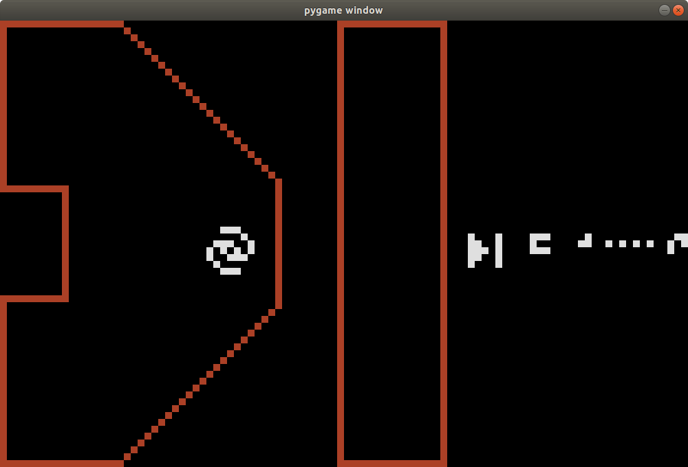

Below is our write-up of the ICFP Contest 2020. I am Alexander Golovanov, I work at AIM Tech and also have a team MIPT Godnotent, so our team is called `AIM Tech + Godnotent`.

# About one month before the contest

One of my colleagues dropped an announcement about this year ICFPC edition in one of our working chats. I didn't take part in the previous editions, except for [2016](http://icfpc2016.blogspot.com/), when I spent a couple of hours solo doing some origami and visualizing some pictures of what I needed to to, so it actually doesn't count. My colleagues took part last several years, so they decided to participate this year also. However, a part of them went to a trip, and another part decided do decline because in the previous edition the rules changed drastically after lightning round and all the written code became useless. I intended to participate with my ICPC team + our coach, as we did, for example, in Google Hash Code.

# Two weeks before the contest

I found out that ICFPC twitter account had some retweets of Ivan Zaitsev, who asked to help him with deciphering some messages from space. At first I didn't know if it is true or just a story, but then the messages turned out to arrive at the specific time every day and define some operators by a grid-aligned signals, so it became clear that it's some sort of en entertaining fairytale.

However, there were also posts [0](https://pegovka.space/#/post/0) and [1023](https://pegovka.space/#/post/1023) on [pegovka.space](https://pegovka.space). We tried to run some steganographic deciphers on the flowers pic, but didn't find anything interesting.

# One week before the contest

My colleague Renat `renat` Gimadeev suggested to join our teams. My teammates voted for.

We decided to write the contest mostly in our office -- that is, some of us are in a single meeting room, some of us are in Netherlands (and we are talking via zoom), and some other people join us when it's convenient for them. So far in total there were 13 of us who was going to participate. We have reserved a meeting room and ensured that my team could visit the office at any time without any problems with coming in.

# One hour before the contest

Our coach Mikhail `endagorion` Tikhomirov has arrived. We decided to use the remaining hour to read all the docs on the message from space. It turned out that there was a plenty of info since we last had a look. While we were dealing with the operators, the message about a huge incoming transmission appeared on [pegovka.space](https://pegovka.space). We were sure that it had something to do with the contest.

More our colleagues joined us, and...

# The contest begins

...nothing happened. No statements, nothing. Then encoded messages 16-42 appeared. Then the icfpc website said something like "we've prepared a contest, but it doesn't matter, because we are now talking with aliens, blah-blah-blah". So we divided into two groups: some of us started to decode the messages, and others began playing with the server, sending different queries and analyzing the responses.

I was in the first group. First, I've made a [dictionary](https://golovanov399.github.io/icfpc2020/page.html) page. Also, endagorion wrote a png-to-grid translator, and I wrote a tool which, given a grid, parses it into glyph tokens and tells what it says. Here is the [result](https://github.com/Golovanov399/icfpc2020/blob/parser/parser/readme.md). Also, we were quite confused by the fact that `-5 div 3 = -1`. Seems to be C++-like style.

Still, we didn't know what to do with the `galaxy.txt` file. We thought that we need to wrap the galaxy term using beta- and gamma-reductions. Also I was very confused by the model it used. Is it all typed? If yes, what is the type for the `t` combinator? On one hand, it can be considered as a `bool`, on the other hand, it accepts two arguments. And if it is not typed, what are numbers? Are `nat`s just Church numerals? What are negative numbers then?

During this process Konstantin `zemen` Semenov wrote some code which simplified the galaxy file, and renat was trying to calculate the "balance" of different terms. It wasn't easy: some of us wanted the balance of `nil` to be 0, some of us -- to equal `-1`, et cetera. This continued until we agreed on the following definition of balance: the number of non-aps minus the number of aps. In this sense `balance(ap x t)` was `1`, and every balance was `1`, because:

- in our interpretation it was the number of vertices minus the number of edges of some tree (the node is a term and its children are its arguments);

- in authors' interpretation it was the number of leaves minus the number of other vertices of some binary tree.

6 hours after the contest start, nobody seems to understand what is needed to be done. Also we decided to translate the galaxy file into haskell and run it, but didn't manage to deal with the recursion. We went to sleep, [very upset and demotivated](https://codeforces.com/blog/entry/80044). I mean what the hell, this seemed like a ctf or something, and we are not ctf guys. At least we were 4th in the lightning standings.

# 15 hours of the contest

There appeared several videos on how to deal with the tree. I woke up and wrote a simple tree reduction algorithm like "if we can substitute one non-recursive term into other then do it and then try to beta-reduce". It decreased the number of lines, but the file size has grown. Also I wrote a tree drawer in svg to try to reduce something manually. Then added some typed reductions like `add 0 1 -> 1`. Didn't help a lot.

When I was doing this sort of things (adding more rules, fixing bugs, writing new ones), renat joined me and optimised the code a little. Also I found out that some terms occurrences may be shortened when a term is with an argument (so not just `:1234`, but `ap :1234 x`). Also some terms may be deciphered like this: thus, we found out (empirically) that `:1141` is `take`, `:1128` is `map`, `:1126` is `length` and so on.

# 24 hours of the contest

We finished 7th in the lightning round. Only 3 teams made something reasonable. The prank went too far.

# 28 hours of the contest

endagorion joined us. While I was doing the same stuff, renat and endagorion finally found out that `galaxy` is a term applying a list and a vector, and it turned out that our code reduction thing can handle this in several seconds -- that is, reduce `ap ap galaxy nil ap ap cons 0 0`. We drew the set of points [here](https://golovanov399.github.io/grid/rect_grid_draw.htm) to find out that it is a galaxy image and that we are on the right path.

After we manually wrapped some other queries, the calculation of the query from the "window" (2x2 square) happened to be very slow.

This is approximately when the galaxy evaluator was published from the authors. It looked so simple I was ashamed. Why didn't we come up with this earlier? Because of currying of terms which are also bools? I don't know.

I decided to create a new [branch](https://github.com/Golovanov399/icfpc2020/tree/mega-pussy-destroyer) with two purposes: to write a new evaluator and to make an utility for some basic yet important tools: modulate, demodulate, evaluate galaxy; short, switch between human-readable (`[[], (0, 0)]`), apapcons (`ap ap cons nil ap ap cons ap ap cons 0 0 nil`), and modulated (`1100111101001000`). We already had (de)modulator an stuff, but not in one place. I transpiled the code into C++ and the new galaxy evaluator worked in under a second on anything we gave it. Facepalm.

I called this mode `destroy`. So anyone who wanted to evaluate the galaxy on some input had to type `./destroy galaxy`. Reflected my intentions quite precisely.

Meanwhile endagorion made a pygame clickable client drawing things. We started to play around. There was a galaxy with clickable locations. Some of them lead to nowhere, just showed some beings. Some of them lead to static pics we didn't manage to parse. Some of them were interactive.

## Tic-tac-toe

endagorion quickly realized the he needed to obtain a draw in as many ways as possible. Instead of writing an automated solution, he started to play by hands.

## Weird 8x8 glyphs

I decided to play with the other game. There was a 8x8 board with glyphs which represented numbers in a known format. One could

- click on a glyph, making it red,

- click on another glyph, making that first glyph white again.

Two of them were equal. We clicked on them. They disappeared. Hmm.

Others were not equal so I just wrote an auto clicker which iterated over all pairs and tried to obtain another game state.

endagorion won his game when I was implementing the bruteforce and maybe even waiting for it to finish. After both victories a mysterious list in the game state was expanded by a number (we called them _flags_). Not only this, but we also got weird pictures:

 

Mikhail called them _achievements_ and I understood that indeed they were. I realized that we are now basically running something obtained from \~300 kilobytes of text (not even zipped), and a thing this small is actually giving us new abilities, though I didn't know what they did. Really, this is like a big message after killing a boss in a videogame: "Congratulations! You now have ⏭️. You can now transform 1 to 2."

Then we found a tutorials section but barely understood it (however we found out that we can drive a ship or something, and modify its velocity, and it has some inertia, and there are a lot of numbers in its state, and it can be analyzed... tomorrow) and decided to go to sleep. It was at 6:00 am local time, that is, 34 hours before the contest ends.

# 26 hours before the end

At the evening I thought that it would be wonderful if we could save and load in some locations, moreover, it's easy to implement. So went to the caffee and did it while eating my breakfast (breakfast at 2:00 pm, yes). We then used it mainly to switch between the galaxy screen and the tutorials and multiplayer room.

After that I went to office and didn't do a lot -- there is no fun for me in doing this without collaborating, and almost all my teammates decided to spend their weekend doing something else. I passed the tutorial, though. It gave me basic understanding of what is needed to be done and what we can -- like splitting into two ships (which I called shadow cloning). I knew that the most interesting part was beginning just then.

endagorion arrived at \~8:00 pm (20 hours before the end). I showed him the tutorial walkthrough and how to enter multiplayer room, and he watched the videos in twitter and found the way to start a multiplayer game.

After this (in some order) I wrote a cli for communicating with server and performing actions, and Mikhail played games from two windows with himself and investigated the incoming messages. Then I wrote some sort of pretty-printer of ship parameters, and after a lot of time staring at the parameters we (mostly Mikhail) found a valid interpretation of the game:

- There are two ships and a celestial body which attracts them (we called it _sun_). One of the ships is an _attacker_, the other is a _defender_. First one wants to kill the second, maybe for the price of its own life, the second wants to survive. Ok, this kind of was announced.

- Every ship has position and velocity. Also it can use fuel to modify its velocity by any vector from [-2, 2]x[-2, 2]. This looks like fuel, so we called it fuel. It was represented by a parameter which was never increasing.

- Ships can shoot (and set the power of it). Shots can increase some parameter, but no more than the other (constant) parameter. Instead they waste fuel. We described this in the following way: each ship is initially cold. There is a limit of how it can warm up. Any warming exceeding this limit spends fuel. In case if the fuel is empty, the ship dies. When one uses fuel to change the velocity, it warms up. When one shoots, it warms itself up (proportional to the shoot power) and in case if it hits the other ship, it warms up too.

- Ships have a cooling which reduces its temperature each tick. Despite the fact that we got rid of health-notation, we called it _regeneration_.

- A ship can do kamikaze, but we didn't consider it a lot.

- If a ship leaves the battleground, it gets cold and (almost) instantly uses all its fuel to warp up and dies.

- If a ship lands on the sun, it burns and dies.

- A ship can divide itself into two others (it wasn't described in the docs, but it also wasn't very difficult to return to the tutorial and . It must divide all of its stats (that's how we called parameters) between it and its clone.

I honestly do not remember when we found out all of this. Probably it was after we sent a dummy version of the strategy which did nothing (and gained us some rating). That is, during the third stage.

# 12 hours before the end

From this I felt very tired and did mainly analytic work -- that is, a little debugging, watching games, analyzing our weaknesses and suggesting something to implement, and Mikhail was writing the strategy. I pay respects. Truly a son of a long battle.

We watched some games and found the guys who were just chilling near the sun. We liked it and did the same. Many others couldn't do many at the moment and died in 6 ticks.

Meanwhile endagorion found out the formula: `E + 4L + 12R + X <= 512` (`E` for energy/fuel, `L` for the laser power, `R` for regeneration, and `X` for some noname stuff limiting the number of clones). It was obtained empirically (by a script, that's when my cli stopped being useless) by trying to start a game with some parameters. I noticed that the parameter 512 was in the `staticGameInfo` and for the defender it was 448. Mikhail confirmed that the right hand side seemed to be 448 for the attacker. This is when we changed our starting stats (mainly increased fuel to stay longer).

Also we wanted to use the attacker for shooting (there became more and more people who didn't just fall into the sun). We found that some guys have 128 maximal temperature, while we had only 64. This is when Mikhail had an insight that we could pass our minigames-achievement-flags on joining the game instead of `nil`. I tried, and it worked! Miracle.

So then Mikhail implemented some flying -- he managed to use about 30 fuel to stand at a stable orbit -- that is which didn't require any velocity perturbations. We did it and then did some shooting in some moments -- I don't remember when. However, we still didn't know how the shooting damage is calculated.

# 8 hours before the end

Meanwhile we seemed to notice that the shooting damage in generally significantly greater when we hit the exact center of the ship. So we started to dodge sometimes. It costed us some fuel, but maybe we became more evasive and unpredictable.

# 6 hours before the end

My colleagues started to arrive at the office.

We did nothing essential. Changed some parameters. Added more if conditions on dodging. Meanwhile our enemies evolved, and we were trying to sort the shooting out.

Also we introduced cloning. We decided to clone as a defender into many `[0, 0, 0, 1]` pieces. endagorion made a unique stable orbit for each of them. Most of the times our enemy didn't succeed to shoot them out in time. Some guys, however, managed to do this (seems that they reverse-engineered the shooting). Some other guys made many attacker `[0, 0, 0, 1]`-clones and sent them to kamikaze the shit out of us. We didn't actually want to pay attention to this -- the strategy was very unpopular (despite the fact that one `[0, 0, 0, 1]` guy could make, I don't remember, maybe around 100 damage; well, a `[1, 0, 0, 1]` guy certainly could).

# Last 4 hours

Nothing major happened. Nikita `hippskill` Mikhaylov joined us and started to tweak some parameters in his own branch. Mikhail made orbits wider. Our attacker just patroled its orbit and was shooting quite rarely and when the distance was not very big. We started to encounter very weird bugs, such as falling to the sun in some of the spawn points. Afair, we fixed it.

The final stage was frozen and we didn't do much. Mikhail chose the most stable version and choose it active. That's all I guess.

# The answers

Of course the shooting mechanics, as the gravity algorithm, were explained in non-interactive levels in the galaxy (I say _of course_ because I know this a posteriori). We decoded gravity quite easily (by downloading a bunch of logs using api and visualizing the gravity accelleration lengths). I don't want to spoil it here, though.

# Conclusion and acknowledgements

After all this I can say that this was an extremely well organized contest which contained two separate parts -- the one with building the galaxy evaluator and the one with ships and stuff. It had some disadvantages, such as a very frustrating start when you don't know what to do and consequently why you should do it. It reminded me final editions of [Deadline 24](https://www.deadline24.pl/), except it's not 24 (and not 72 -- in our case it was around 20) and you start tired. In the end I think I like the setting.

The [final video](https://www.youtube.com/watch?v=Me-0k5XGZWY) was very heartwarming -- the moment when Ivan Zaitsev remove his robe was for me a gesture of finishing the story and moving forward, returning back to normal life. That is to say, thank you, [SKB Kontur](https://kontur.ru). It was amazing to watch how my personal intention was changing from _"Okay, nice lightning round scoreboard, nice discord answers, I hope you will not organize anything else ever"_ to _"Wow, so we need to write our own framework to work in this galaxy thing, and our performance depends on this, then we know how to do stuff, after that we investigate the protocol, and **then** we play the **actual** game, WOW! And maybe there are also easter eggs!"_

Of course I want to thank all my teammates, especially Renat `renat` Gimadeev and, of course, Mikhail `endagorion` Tikhomirov, who, in the end, did all of the work.

And I'm grateful for everyone involved in the fact that Mikhail and I had constant access to our office. We couldn't do this from separate places.

My impressions are impossible to describe. Thank you all.

# Photos

